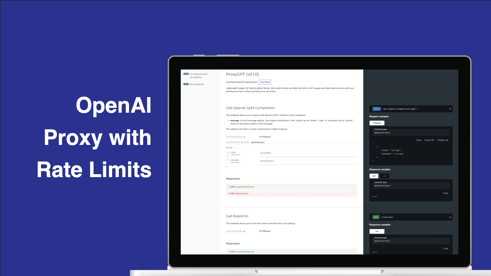

# 🌎 ProxyGPT

## Overview & Features

ProxyGPT is a dockerized lightweight OpenAI wrapper using FastAPI. This solution allows you to add custom hourly and daily rate limits to your OpenAI API usage, and share OpenAI access with your team without providing your secret key. This is a more secure option for sharing credentials during development, as OpenAI has yet to provide an API key-specific usage cap. You can confine OpenAI API usage through ProxyGPT with hourly and daily rate limits, in addition to only exposing specific endpoints of the OpenAI API. ProxyGPT also allows you the ability to reset or remove your team's access to the OpenAI API for only the services or people using a specific instance of ProxyGPT, rather than needing to reset the original OpenAI API key which could impact other projects if multiple services are using the same key (which is not recommended in production).

The use of ProxyGPT is only recommended in development. In production, the rate limit logic used in this application can be copied to your own application. In addition, you should use seperate OpenAI API keys for different projects and services.

See [Installation](#installation) to get started.

## Installation

1. First, download the repository.
2. Next, configure the settings in settings.py.

    USE_HOURLY_RATE_LIMIT (bool)
   
    USE_DAILY_RATE_LIMIT (bool)
   
    INSECURE_DEBUG (bool)
   
Note that both rate limits can be active and enforced simultaneously.

4. Set the environment variables in .env. See [Environment Variables](#environment-variables).
5. Run with or without Docker. See [Running with Docker](#running-with-docker) and [Running without Docker](#running-without-docker).

## Customization

If you wish to use ProxyGPT out of the box for only the gpt-3.5-turbo chat completion model, you can skip this section. 

In order to customize ProxyGPT with new endpoints, simply add them in main.py based upon the implementation of get_openai_gpt3_completion. Ensure you handle errors and log API usage as is done with get_openai_gpt3_completion.

## Details

This project was developed with the goal of creating a simple and lightweight OpenAI wrapper, optimized for short-term development use. Strong documentation, easy customizability, and comprehensive initialization checks were integrated throughout the codebase. As part of the project's simple design, the service employs a local SQLite database, forgoing the use of long-term storage solutions like Docker volumes. Since the sole use of the database is to record the frequency of API usage, facilitating the implementation of rate limiting, long-term data storage is not needed. Previously stored API usage statistics become redundant after the passing of one day or one hour, based upon on the rate limit.

It's important to understand that the rate limits currently apply for any calls to OpenAI, meaning all calls will increase the rate count, irrespective of whether or not they were successful. This is simple to change if you wish, and just requires different placement of the log function to after validation of the response from the OpenAI API.

Rate limits, hourly and daily, are not tied to calendar hours or days. Instead, they operate on rolling windows of time, specifically the last 3600 seconds for hourly limits, and 86400 seconds for daily limits. Thus, usage counts do not reset at the beginning of a new day or hour, but are only no longer counted once they are greater than one hour or one day from the current time.

In addition, you can use both hourly and daily rate limits together, just one of the two, or none. They are seperate checks, and if either are active and the usage exceeds them, the call to ProxyGPT will be returned with status code 429 (Too Many Requests).

You can view the enabled rate limits and current usage from the /ratelimit endpoint. Use /docs or /redoc to explore all the endpoints by ProxyGPT.

Finally, it should be noted that any errors that arise in the code may be passed directly to the API client for easy debugging. However, this increases the risk of leaking any secret keys stored on the server side. You can turn this off by changing INSECURE_DEBUG to False in settings.py.

## Environment variables

Required:

OPENAI_API_KEY = str: Your secure OpenAI API Key

PROXYGPT_API_KEY = str: Your strong custom API key for the proxy

Optional:

If using hourly rate limit (from settings):

   PROXYGPT_HOURLY_RATE_LIMIT = int: max amount of calls to OpenAI through proxy allowed within a rolling one hour window

If using daily rate limit (from settings):

   PROXYGPT_DAILY_RATE_LIMIT = int: max amount of calls to OpenAI through proxy allowed within a rolling one day window

## Running with Docker

### To build the docker image
~~~
docker build -f Dockerfile -t proxygpt:latest .
~~~

### Run docker image in same directory as env file
~~~
docker run --env-file .env -p 8000:8000 proxygpt:latest
~~~
Set environment variables in .env first. Run with -d for detached.

ProxyGPT is now online, and can be accessed at http://127.0.0.1:8000. Visit http://127.0.0.1:8000/docs to explore the auto-generated documentation.

## Running without Docker

### To create virtual env
~~~
python -m venv venv
~~~

### To activate virtual env
~~~
source venv/bin/activate
~~~

### To install libraries
~~~
pip install -r requirements.txt
~~~

### Set environment variables
~~~
touch .env
~~~
Add the variables to the .env file. See example.env and [Environment Variables](#environment-variables).
~~~
export $(cat .env | xargs)
~~~

### Run with uvicorn

~~~
uvicorn main:app --reload
~~~

### Run with gunicorn (alternative for production environment)

~~~
gunicorn -w 4 -k uvicorn.workers.UvicornWorker main:app -b 0.0.0.0:8000
~~~

ProxyGPT is now online, and can be accessed at http://127.0.0.1:8000. Visit http://127.0.0.1:8000/docs to explore the auto-generated documentation.

## Changelog

v0.1.0-beta:
- Initialized Project for Release

v0.1.0:
- Application Tested in Beta, README.md updated

v0.1.1-beta:
- Allow passing in multiple API keys for PROXYGPT_API_KEY

## Future Features

Allow multiple API keys with different rate limits in PROXYGPT_API_KEY

Create graphics module for optionally recording and viewing statistics

Allow use of production database

Add CORS origins restriction option through middleware

Convert endpoints to async so logging and returning data can be executed concurrently